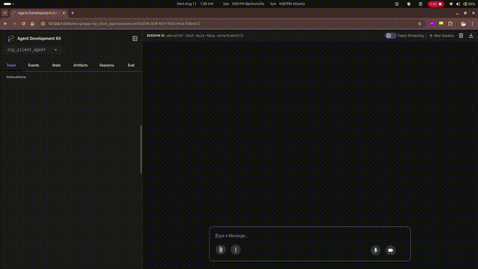

# Agent Development Kit (ADK) and Agent-to-Agent (A2A) Lab

This repository serves as a learning lab for two key technologies:
1. Google's Agent Development Kit (ADK): Build intelligent agents
2. Agent-to-Agent (A2A) Protocol: Make agents talk to each other

## Overview

This lab is structured in two parts:
1. **ADK Implementation**: Learn to build standalone agents
2. **A2A Implementation**: Learn to connect agents

## Quick Start

### Environment Setup

1. Create a new conda environment:
```bash
conda create -n adk-a2a python=3.12
conda activate adk-a2a
```

2. Install the project:
```bash
pip install -e .
```

3. Set up your API key (we use Groq for examples):
```bash
export GROQ_API_KEY='your-groq-api-key'
```
Make sure to update `llm/model.py` (within `src/my_adk` and `src/my_a2a`) to integrate your preferred LLM model.

## Part 1: Getting Started with ADK

### What is ADK?

ADK (Agent Development Kit) is Google's framework for building AI agents. Think of it as a toolkit that helps you:
- Create agents that understand natural language
- Build conversational memory into your agents
- Structure agent responses consistently
- Connect agents to language models (like GPT-4, Gemini, etc.)

### Why Use ADK?

- **Simplified Development**: Built-in state management and LLM integration
- **Structured Interactions**: Clear patterns for handling user inputs and agent responses
- **Production Ready**: Designed for both prototypes and production systems
- **Extensible**: Easy to customize and expand functionality

## Repository Structure

```
src/
├── my_adk/          # ADK Implementation 
└── my_a2a/          # A2A Implementation 
```

## Understanding ADK

### Core Building Blocks

1. **Agents**
   - Your AI assistants that process user requests
   - Can be simple (stateless) or remember conversations (stateful)
   - Connected to language models like GPT-4 or Gemini

2. **Sessions**
   - Like a conversation memory
   - Remembers important information between interactions
   - Keeps track of user-specific details

3. **Runners**
   - The "manager" that coordinates everything - sessions, agents etc.
   - Makes sure messages get to the right place
   - Handles the conversation flow

4. **Models**
   - The AI brains behind your agents
   - Process text and generate responses
   - Can be configured for different needs

### Types of Agents You Can Build

1. **Simple (Stateless) Agents**
   - Perfect for quick, one-off tasks
   - Each request is independent
   - Like asking for the weather each time

2. **Stateful Agents**
   - Remember previous interactions
   - Can handle complex tasks over time
   - Like a personal assistant that tracks your tasks

### Tips for Building Agents

1. **Planning Your Agent**
   - Decide what your agent needs to remember
   - Plan how it should respond
   - Keep instructions clear and specific

2. **Testing**
   - Start with simple interactions
   - Test edge cases
   - Verify state management works

3. **Best Practices**
   - Write clear instructions for your agent
   - Structure responses consistently
   - Handle errors gracefully

## Part 2: Getting Started with A2A

### What is A2A?

A2A is a protocol that enables agents to:
- Discover each other's capabilities
- Exchange messages in a standardized way
- Work together to solve complex tasks

### Why A2A?
A2A provides a flexible and scalable way to build complex workflows by breaking them down into smaller, manageable components. This approach enables:

- Modularity: Agents can be developed and tested independently, reducing the complexity of the overall workflow.
- Reusability: Agents can be reused across different workflows, reducing development time and effort.
- Scalability: Workflows can be easily extended or modified by adding or removing agents.


### Simple A2A Implementation

Our current implementation shows the basics of A2A:

1. **Agent Card**
   - Like a business card for your agent
   - Lists what your agent can do
   - Helps other agents understand its capabilities

2. **Message Exchange**
   - Standardized message format
   - Request/response pattern
   - Structured data exchange

### Running the Simple A2A Example

1. Start the server from root directory:
```bash
python src/my_a2a/simple_a2a/main.py
```

2. View the agent card at http://0.0.0.0:9999/.well-known/agent.json

3. Test the agent:
   - Use the included client script
   - Or send requests via API

## Multi A2A Implementation

### What is a Client in A2A?
In the context of **Agent-to-Agent (A2A)** systems, a **client** is the entry point that interacts with your multi-agent setup.  
It is responsible for:
- **Initiating requests**: Sending queries, commands, or data to A2A agents.
- **Receiving responses**: Collecting the output from agents after the orchestration and task execution.
- **Abstracting complexity**: Allowing external systems or users to interact with the multi-agent architecture without worrying about internal communication flows.

Think of it as the *“remote control”* for your multi-agent framework - you don’t need to open the TV and touch the circuits, you just send a signal and get results.

### Building an A2A-Compliant Agent

When developing an agent for an A2A (Agent-to-Agent) setup, there are three main components to consider:  

#### 1. Agent Logic
The **core agent logic** is the intellectual engine of your service. This part is **framework-agnostic** and contains the essential functions that perform your agent's task.  
It can be:
- A simple Python function
- A complex machine learning model
- A database query
- A tool-powered workflow (e.g., LangChain, LangGraph)

Key principle: **It should only focus on its task** and remain unaware of A2A protocol specifics.

#### 2. The A2A-Compliant Agent Executor
The **Agent Executor** acts as the bridge between the A2A runtime and your core agent logic.  
Its role is to:
- Receive incoming **A2A requests**  
- Manage **task state** and **lifecycle**
- Convert A2A request format into your internal logic’s expected format  
- Run your agent logic
- Convert results back → A2A-compliant response

**To be A2A-compliant**, it must:
- Inherit from the `AgentExecutor` base class  
- Override two core methods:
  - **`execute(self, context: RequestContext, event_queue: EventQueue)`**  
    Handles the entire request lifecycle - input parsing, logic execution, and sending the final response.  
  - **`cancel(self, context: RequestContext, event_queue: EventQueue)`**  
    Handles cancellation requests for long-running tasks.  
    If not applicable, raise `NotImplementedError`.

#### 3. Main Entry Script (`main.py`)
The **main script** packages everything and launches the agent as a live service.

It must:
- **Define the Agent Card**: The agent’s “business card” - name, description, and capabilities.
- **Bind the Executor**: Ensures incoming requests are processed by your executor.
- **Start the A2A server**: Makes the agent discoverable and callable by other agents.


### This Repository
This repo demonstrates a **multi-A2A implementation** for NLP tasks:
- **Sentiment Analysis Agent**
- **POS Tagging Agent**
- **Planner Agent** (orchestrates workflow)
- **Greeting Agent** (simple conversation starter)

It creates an **end-to-end workflow**, where the planner delegates tasks to the appropriate NLP agents, and all agents communicate via A2A. To highlight its framework-agnostic design, the current setup includes agents built with ADK, LangChain, and LangGraph. Additional agents can be seamlessly integrated into the service following the same approach.

### Running the Multi A2A Example
1. Start each agent individually:
   - `greeting_agent`
   - `pos_tag_agent`
   - `sentiment_agent`
   - `planner_agent`  
   ```bash
   cd src/my_a2a/multi_a2a_1/<agent_name>
   python main.py
   ```
2. Start the client using adk web client:
   ```bash
   cd src/my_a2a/multi_a2a_1/client
   adk web
   ```

3. Open the provided ADK Web URL in your browser.

#### Demo:


## Contributing

Feel free to:
1. Try the examples and give feedback
2. Suggest improvements
3. Report any issues you find

## License

This project is licensed under the terms of the LICENSE file included in the repository.